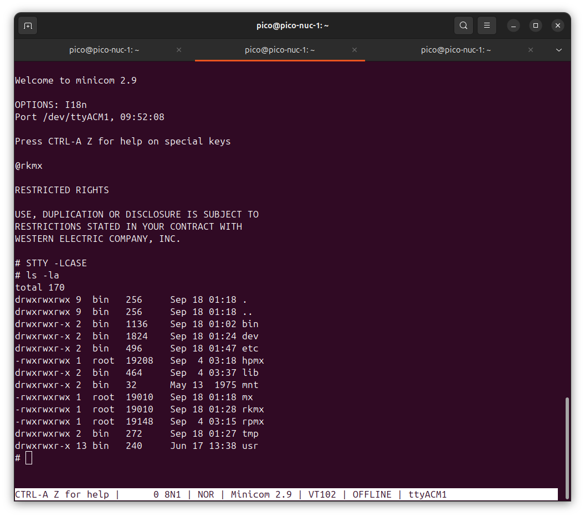
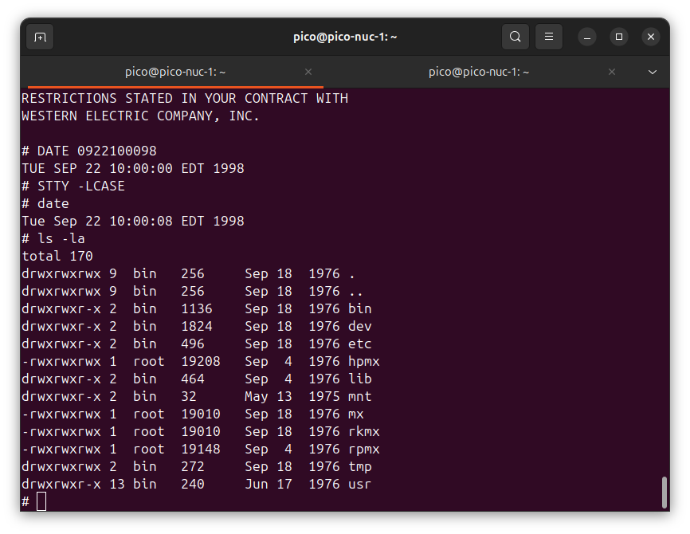

# How to use the PDP-11 emulator

Step-by-step instructions for the [PDP-11 emulator for the Pico W and Pico 2 W](../README.md): flash a board, connect a terminal, boot Unix, set the date, re-flash without the button, build your own disk image and build the firmware.

| Step | Section |
|---|---|
| Put the emulator on a board | [2. Flash the Pico 2 W](#2-flash-the-pico-2-w-rp2350), [3. Flash the Pico W](#3-flash-the-pico-w-rp2040-two-steps) |
| See its console | [4. Connect a serial terminal](#4-connect-a-serial-terminal) |
| Use Unix | [5. Boot and use Unix](#5-boot-and-use-unix) |
| Re-flash without the button | [6. Re-flash without the BOOTSEL button](#6-re-flash-without-the-bootsel-button) |
| Your own disk | [7. Build your own disk image](#7-build-your-own-disk-image) |
| Your own firmware | [8. Build the firmware and images with PureMetal Forge](#8-build-the-firmware-and-images-with-puremetal-forge) |
| Run the DEC diagnostics | [9. Run the diagnostic ladder](#9-run-the-diagnostic-ladder) |
| A board with PSRAM | [10. The PSRAM boards](#10-the-psram-boards) |

## 1. What you need

| For | You need |
|---|---|
| Running it | A Raspberry Pi Pico 2 W or a Pico W, a USB cable that carries data, and a serial terminal program on the host |
| Building a disk image | Python 3 (the tools are Python scripts in `tools/`; see [TOOLS.md](TOOLS.md)) |
| Building the firmware | Python 3 and PureMetal Forge (`PureMetalForge.exe`), the compiler. It is not in this repository; the forum is at <https://forum.ajtaji.com> |

The ready-to-flash files are in `images/`:

| Board | Files | Runs |
|---|---|---|
| Pico 2 W (RP2350) | `images/pico2w-v6/combined.uf2` | Sixth Edition Unix (V6), memory management on |
| Pico W (RP2040) | `images/picow-mini-unix/firmware.uf2`, then `images/picow-mini-unix/minix.uf2` | Mini-Unix |

Sizes and SHA-256 values are in [images/README.md](../images/README.md).

## 2. Flash the Pico 2 W (RP2350)

One file, one copy.

1. Hold the board's **BOOTSEL** button while plugging it into USB.
2. A drive named `RP2350` appears.
3. Copy `images/pico2w-v6/combined.uf2` onto it.
4. The board writes the file and restarts by itself. `combined.uf2` holds the firmware and the V6 disk pack together.

## 3. Flash the Pico W (RP2040), two steps

The Pico W takes **two files in two separate BOOTSEL sessions**. On the RP2040 a single combined file leaves the disk area unwritten (the start-up line then says `RK0: no pack`), so the firmware and the pack are flashed separately.

1. Hold **BOOTSEL** while plugging the board into USB. A drive named `RPI-RP2` appears.
2. Copy `images/picow-mini-unix/firmware.uf2` onto it. The board restarts.
3. Enter BOOTSEL again (the button, or the phrase in [section 6](#6-re-flash-without-the-bootsel-button)). The `RPI-RP2` drive appears again.
4. Copy `images/picow-mini-unix/minix.uf2` onto it. The board restarts into Mini-Unix.

If the start-up line says `RK0: no pack`, the second file is missing: repeat steps 3 and 4.

## 4. Connect a serial terminal

The board is a USB serial device: a COM port on Windows, `/dev/ttyACM0` or similar on Linux.

| Setting | Value |
|---|---|
| Speed | 115200 (the rate does not matter: it is USB) |
| Data / parity / stop | 8N1 |
| Line endings | CR, LF and CR LF are all accepted; pasted text is fine |

Open the port **within 30 s of power-up**: the firmware waits up to 30 s for the port to open before it starts, so the first lines are not lost.

Linux example (minicom, as in the screenshots below):

```
minicom -D /dev/ttyACM0
```

On a Pico 2 W the `#` prompt appears 3.4 s after the port opened (2 s of that is the Esc wait); on a Pico W, 3.2 s.

## 5. Boot and use Unix

### Automatic boot

Each board powers up into Unix with no typing. The Pico 2 W prints:

```
PDP-11 J-11 on Pico 2: serial tape reader ready
RK0: v6root, 4872 blocks, swap 4000-4871 in RAM, READ-ONLY: the flash is never written
auto-boot: RK0, switches 173030, then "rkunix" at the @ prompt. Press Esc within 2 s for the diagnostic console.
booting RK0, switches 173030
@rkunix
mem = 76
#
```

The Pico W prints the same, with `mini-unix` and `rkmx`, and Western Electric's "RESTRICTED RIGHTS" notice before the `#`.



### Boot by hand from the console

Press **Esc** within 2 s of the `auto-boot:` line. The board then stays in the firmware's own console instead of booting. There:

| Type | What it does |
|---|---|
| `BOOT RK0 173030` | Boots the disk pack by hand. The switch register value 173030 (octal) selects single-user mode |
| `rkunix` (Pico 2 W, V6) or `rkmx` (Pico W, Mini-Unix), at the `@` prompt | Names the kernel to start, in lower case |

The `@` prompt repeats if the kernel name is not on the disk. Do not boot an unsupported kernel: the system may hang. The diagnostic tools (`tools/tape_ladder.py`) can load paper tapes from this console.

### Logging in

There is no login and no password. Boot is complete at the `#` prompt, where you are root in single-user Unix. Normal Unix commands can be entered from there.

### Upper and lower case

Both systems print in capitals: their terminal setting assumes an upper-case-only terminal. Type in lower case. On Mini-Unix, `stty -lcase` switches the output to mixed case (as the screenshots show).

### Pasting text

A file can be pasted into `cat >name` at any speed: see
[Pasting text](../README.md#pasting-text) in the README for what was
measured on both boards and what Unix itself still limits (`#`, `@`,
capitals, lines over 255 characters). `stty -lcase` first keeps capitals.

### Set the date and time

Optional. The `date` command takes the date as `MMDDhhmmYY`, with a **two-digit year** (it is not Y2K compliant). For 22 September, 10:00, year 98:

```
# date 0922100098
```

The system answers `Tue Sep 22 10:00:00 EDT 1998`, and `date` on its own then shows the clock running.



### V6 notes (Pico 2 W)

- `ps` works.
- `df` with no argument looks for V6's built-in `/dev/rk2` and `/dev/rp0`, which this machine does not have: type `df /dev/rk0`.
- `dc` is too large for the 56 KB machine.

### Live statistics

Type **Ctrl-]** then `s` at any time. The firmware prints a block with the clock (measured at start-up), the emulated instructions per second, memory in use, disk reads and writes, RAM overlay use, the line clock, uptime, what each core does, and the longest gap between two USB services since the banner. These two keys never reach Unix (Ctrl-] twice sends one Ctrl-] through).

### Shutting down

Unplug at any time. The emulator never writes the flash: every disk write, the swap area included, goes to RAM and is lost at power-off, and the next power-up starts from the pack as flashed. `sync` does no harm but saves nothing across a power cycle.

### If something looks wrong

| You see | Meaning |
|---|---|
| Nothing printed | The port was opened late, or the board is not running the firmware. Reconnect, and open the port within 30 s of power-up |
| `RK0: no pack` (Pico W) | Only `firmware.uf2` was flashed. Flash `minix.uf2` as well ([section 3](#3-flash-the-pico-w-rp2040-two-steps)) |
| `@` repeated | The kernel name typed is not on the disk |
| `[RK0: the RAM overlay for file writes is full ...]` | The RAM for file writes is used up; power off to start clean (see [Known limits](../README.md#known-limits)) |
| `panic: out of swap space` (V6) | A session needed more than the 112-block swap RAM disk; power off to start clean |

## 6. Re-flash without the BOOTSEL button

A board already running this firmware enters BOOTSEL when it receives this text on its serial port:

```
ResetPicoToBootSel1254
```

Send it from any terminal program, or from a script that writes the text to the port. The BOOTSEL drive appears and you can copy a UF2 as in sections 2 and 3. This is also the quick way to reach the second BOOTSEL session on a Pico W.

## 7. Build your own disk image

`tools/rk_image.py` turns an RK05 disk image into a UF2 that writes the board's flash disk region (0x10040000 up) and leaves the firmware alone. All the Python tools are described in [TOOLS.md](TOOLS.md).

1. **Get an RK05 image.** The Unix packs are in `media/unix/` (`v6root.gz` is gzipped; `mini-unix.rk05` is in the repository root). Unzip a `.gz` first.
2. **Look at it.** `info` prints the size, the Unix file system (V6 or V7), the blocks in use and how many fit each chip:

   ```
   python tools/rk_image.py info mini-unix.rk05
   ```

3. **Change it (V6 only).** `tools/v6fs.py` reads and changes a V6 file system inside the image: `ls`, `cat`, `mknod`, `ln`, `rm`, `patch` and `check`. Each changing command writes the whole image to `-o`.

   ```
   python tools/v6fs.py ls    IMAGE /dev
   python tools/v6fs.py check IMAGE
   ```

4. **Pack it.** Choose the chip, the layout and what boots:

   ```
   python tools/rk_image.py pack IMAGE --chip pico|pico2 -o OUT.uf2
          [--layout auto|dense|mapped] [--blocks N] [--name TEXT]
          [--swap auto|LO,N|none] [--boot-block FILE|@/PATH]
          [--autoboot KERNEL[,SWITCHES]]
   ```

   - `--layout dense` stores block n in slot n (a full 4872-block pack fits the Pico 2 W). `mapped` stores only the blocks in use (Mini-Unix on the Pico W). The default picks dense when it fits.
   - `--swap` names the swap area, which the firmware keeps in RAM.
   - `--autoboot rkunix` makes the pack boot at power-up: `BOOT RK0` with the switch register at 173030, then the kernel's name typed at the boot block's `@`.
   - `--boot-block @/usr/mdec/rkuboot` copies that file from the image's own V6 file system into block 0 (the V6 root pack has no boot block of its own).
   - `--firmware diag.bin --combined OUT.uf2` writes firmware and pack as one UF2 (Pico 2 W). `--firmware-uf2 OUT.uf2` writes the firmware alone (the Pico W's first file).

5. **Flash it** as in sections 2 and 3. A pack-only UF2 goes onto a board that already has the firmware.

Limits: RK05 packs only (up to 4872 blocks), drive 0 only, firmware under 256 KB, V6 only for `v6fs.py`. A complete worked example is in section 8.

Under Git Bash on Windows, put `MSYS_NO_PATHCONV=1` in front of any command with an argument that starts with `/` or `@/`, or Git Bash will turn it into a Windows path.

## 8. Build the firmware and images with PureMetal Forge

You need Python 3 and the PureMetal compiler (`PureMetalForge.exe`), the
release build from compiler main `b9b70ed1` or later: the firmware keeps the
lazy N/Z flags in r4 (`#RESERVE_MORE = 1` in `cpu.pico(2)`), and the
dispatch tails are assembly blocks that name the reserved registers
(`ASM Uses`; `#ASM_TAILS = 1` in `pico/instructions.pico` and in
`pico2/cpu.pico2`) and asks the USB serial library for receive flow control
(`#USB_RX_HOLD = 1` in `diag.pico(2)`), which that release has. From the
repository root:

**Pico 2 W, V6** (`images/pico2w-v6/combined.uf2`):

```
python tools/tape2pico.py --empty
cd J11_18MHz_KDJ11_BF/pico2
PureMetalForge.exe --compile diag.pico2 -t rp2350 -o diag.bin
python -c "import gzip,shutil; shutil.copyfileobj(gzip.open('../../media/unix/v6root.gz'), open('v6root.rk','wb'))"
python ../../tools/v6fs.py mknod v6root.rk /dev/rk0 b 0 0 -o v6root.rk
python ../../tools/v6fs.py mknod v6root.rk /dev/rrk0 c 9 0 -o v6root.rk
python ../../tools/v6fs.py mknod v6root.rk /dev/swap b 0 0 -o v6root.rk
python ../../tools/v6fs.py rm v6root.rk /unix -o v6root.rk
python ../../tools/v6fs.py ln v6root.rk /rkunix /unix -o v6root.rk
python ../../tools/v6fs.py patch v6root.rk /rkunix _nswap 112 -o v6root.rk
python ../../tools/v6fs.py check v6root.rk
python ../../tools/rk_image.py pack v6root.rk --chip pico2 --blocks 4872 --boot-block @/usr/mdec/rkuboot --swap 4000,112 --name v6root --autoboot rkunix --firmware diag.bin --combined combined.uf2 -o v6root.uf2
```

The `v6fs.py` lines give V6 the device nodes `ps` and `df` need, make
`/unix` the kernel that actually runs (`ps` reads its symbols from
`/unix`), and size the kernel's swap to the firmware's swap RAM disk.

**Pico W, Mini-Unix** (`images/picow-mini-unix/firmware.uf2`, `minix.uf2`):

```
python tools/tape2pico.py --empty
cd J11_18MHz_KDJ11_BF/pico
PureMetalForge.exe --compile diag.pico -t rp2040 -o diag.bin
python ../../tools/rk_image.py pack ../../mini-unix.rk05 --chip pico --name mini-unix --autoboot rkmx --firmware diag.bin --firmware-uf2 firmware.uf2 -o minix.uf2
```

The compiler's output is the same byte for byte from the same source and
the same compiler. With main `b9b70ed1` these reproduce the committed
files; compare with the SHA-256 values in `images/README.md`. The firmware's
defaults (`#DISK_BACKEND = 2`, `#DISK_READ_ONLY = 1`, `#DESK_PROBE = 0` at
the top of `diag.pico(2)`) are the ones the images use.

To try an image on the desk emulator instead of a board, add
`--desk desk.bin` to the `rk_image.py` line and run `desk.bin` in the
PureMetal ARM emulator (`arm_run.exe desk.bin rp2350 1500000000 host=open`).

## 9. Run the diagnostic ladder

The DEC diagnostics in `media/diagnostics/` run through the firmware's
serial tape reader. `media/diagnostics/ladder.txt` lists the 19 tapes, the
options each needs and the expected result: **17 PASS, and two HALTs that
are correct for a J-11** (DZQKC refuses a large CPU; DEQKC reads a register
a KDJ11 does not have).

On a board:

```
python tools/tape2pico.py --empty
(build diag.pico2 or diag.pico as above, and flash its firmware UF2)
python tools/tape_ladder.py --port COM18 --plan media/diagnostics/ladder.txt
```

Esc is not needed: the ladder's first command reaches the console during the
2 s wait, and a firmware with no auto-boot pack never waits.

On the desk: the whole ladder's bytes are too big for one desk build, so
dump a plan of one or a few tapes, build with `#DESK_PROBE = 1`, and run:

```
python tools/tape_ladder.py --dump J11_18MHz_KDJ11_BF/pico2/tape_image.pico2 --plan two.txt --tapes media/diagnostics
cd J11_18MHz_KDJ11_BF/pico2
(set #DESK_PROBE = 1 at the top of diag.pico2)
PureMetalForge.exe --compile diag.pico2 -t rp2350 -o diag.bin
arm_run.exe diag.bin rp2350 6000000000 host=open
```

where `two.txt` holds lines copied from `ladder.txt`. On the desk each tape
runs until it halts or rings a bell, or for 3 s of emulated time, whichever
is first, then the next starts: DFKAB prints `END OF DFKAB` well inside
that; the long T-series tapes need a board (or a longer desk run) for their
first bell.

## 10. The PSRAM boards

The Pimoroni Pico Plus 2 W and the Adafruit Feather RP2350 HSTX run V6 with 248 KB of memory. Their images are `images/picoplus2/combined.uf2` and `images/feather/combined.uf2`.

**With the boot drive.** Hold BOOT while plugging the board in and copy the board's `combined.uf2` to the drive, as in section 2.

**With no button and no drive** (the way the boards here were loaded). The board must be running a program with PureMetal's USB serial (any PureMetal example, or this firmware). The board is named by the USB hub port it is plugged into (`--hub-port N`) or by its USB serial number (`--usb-serial TEXT`), never by a COM number.

1. First time on a board, test one flash sector and read the flash chip's ID:

   ```
   python tools/pack_install.py --board picoplus2 --image images/picoplus2/combined.uf2 --hub-port 9 --compiler PureMetalForge.exe --probe
   ```

   It builds the installer (`pico2/packinstall.pico2`), uploads it through the compiler, and prints the chip (`JEDEC ID EF 40 18 ... 16 MB; size measured by address wrap: 16 MB`) and `test sector at 0x4B4000: programmed, read back the same, erased again, reads blank`. The installer needs `FlashJedecIdRead()` in the compiler's `RP2350/Lib/flashid.pico2`.
2. Send the packs (the installer is running, so no `--compiler`):

   ```
   python tools/pack_install.py --board picoplus2 --image images/picoplus2/combined.uf2 --hub-port 9
   ```

   About 12 s a pack. Each ends `flash checksum 21C285A3 5CA82BF0 = the file's`. A run that stops part way leaves the region marked; run the line again and only the missing sectors are sent.
3. Build the firmware and upload it through the compiler:

   ```
   python tools/psram_build.py --board picoplus2 --compiler PureMetalForge.exe --hub-port 9
   ```

   A firmware upload writes only the firmware's own sectors: the packs stay. The start-up line `pack checksums: RK0 ... RK1 ...` must show the values of step 2 (`pack_install.py --sums` prints the file's).

**The proof session.** `tools/board_session.py` types a script at the Unix prompt on one open of the port and times each step:

```
python tools/board_session.py --hub-port 9 --script docs/psram/proof.txt --out transcript.txt
```

`docs/psram/proof.txt` checks `mem = 1036`, runs `ps`, `df /dev/rk0`, mounts RK1, types and compiles a C program and runs it, times `od /rkunix` twice and takes the statistics block. `docs/psram/swap.txt` keeps twelve 30 KB processes alive at once. The transcripts of both boards are beside them.

**V6 notes for these boards.** `stty -lcase` first if you type C: in upper-case mode `\n` in a string arrives as `N`. `#` and `@` are V6's erase and kill characters. Everything written is lost at power-off.
